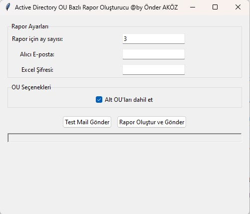

Active Directory OU Bazlı Rapor Oluşturucu (Önder AKÖZ)
=====================================

Kurulum
-------
1. AD_OU_Reporter.exe ve config.ini dosyalarını aynı klasöre kopyalayın
2. config.ini dosyasını bir metin editörü ile açın ve SMTP ayarlarınızı girin
3. Programı çalıştırmak için AD_OU_Reporter.exe'yi çalıştırın

Gereksinimler
-------------
- Windows işletim sistemi
- Active Directory sorgu yetkisi
- PowerShell script çalıştırma yetkisi
- SMTP sunucuya erişim
- Excel yüklü olmalı (Excel yok şifreleme yapamacaktır)

Kullanım
--------
1. Rapor için ay sayısını girin (varsayılan: 3)
2. Alıcı e-posta adresini girin
3. Excel dosyası için şifre belirleyin
4. Alt OU'ları dahil etmek istiyorsanız ilgili kutuyu işaretleyin
5. Test mail göndererek e-posta ayarlarını kontrol edebilirsiniz
6. "Rapor Oluştur ve Gönder" butonuna tıklayın

Raporun İçeriği
--------------
- Her OU için ayrı sayfa
- Domain Admin listesi
- Kullanıcı detayları:
  * Ad
  * Kullanıcı adı
  * E-posta
  * Unvan
  * Departman
  * Yönetici
  * Son oturum tarihi
  * Üye olunan gruplar
  * Hesap durumu

Sorun Giderme
------------
1. Program çalışmıyorsa:
   - PowerShell yönetici olarak çalıştırın
   - Antivirüs programında istisna tanımlayın
   
2. E-posta gönderilmiyorsa:
   - config.ini dosyasındaki SMTP ayarlarını kontrol edin
   - Ağ bağlantısını kontrol edin
   - SMTP sunucusuna erişiminiz olduğundan emin olun

3. Rapor oluşmuyorsa:
   - Active Directory yetkilerinizi kontrol edin
   - PowerShell script çalıştırma yetkilerinizi kontrol edin

İletişim
--------
Teknik destek için onder7@gmail.com iletişime geçin.
Önder AKÖZ / System & Network Specialist
